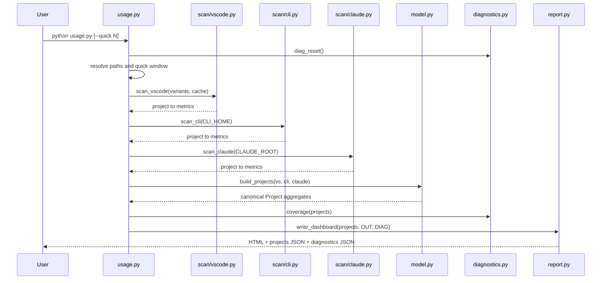
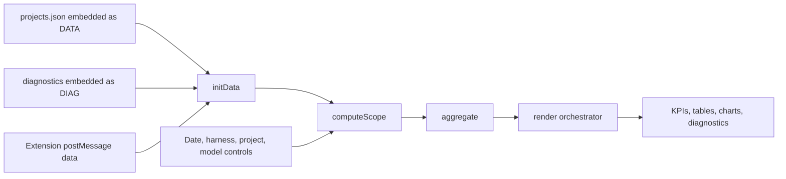
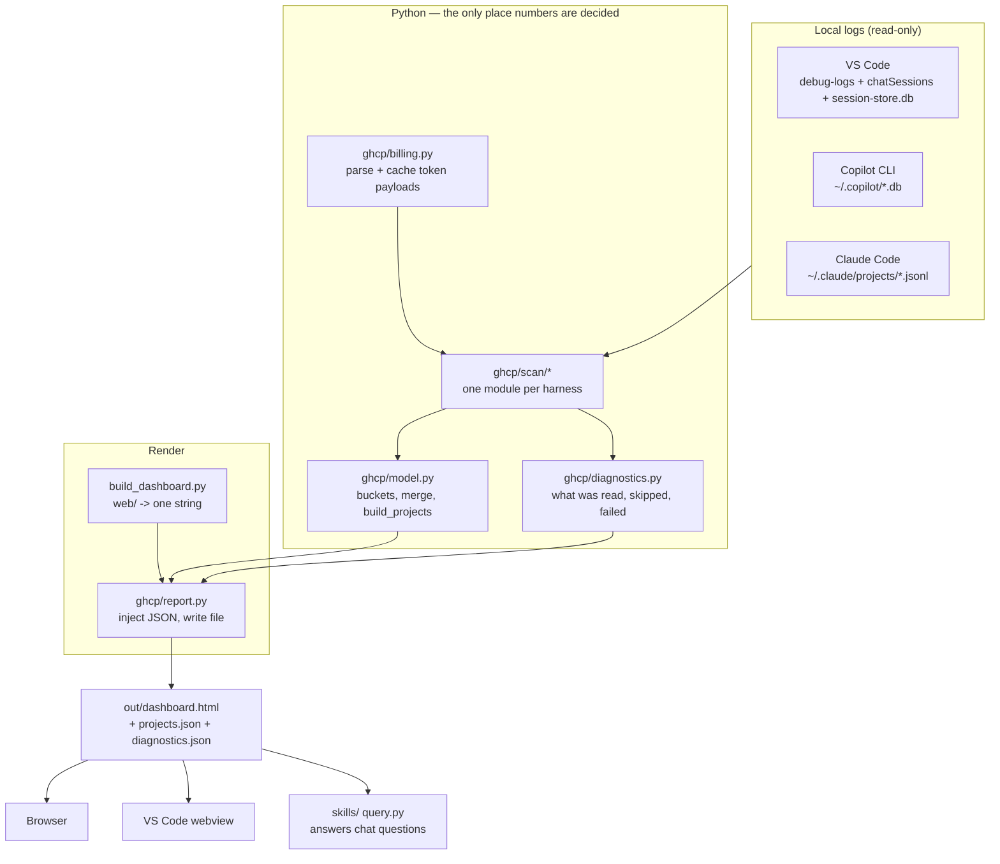
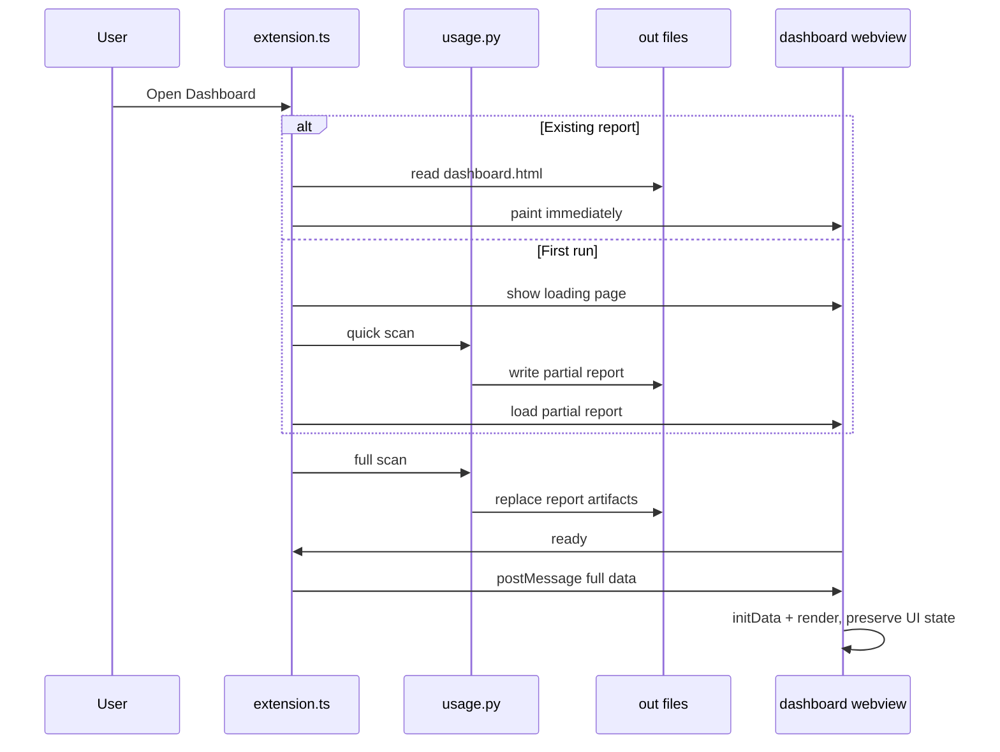
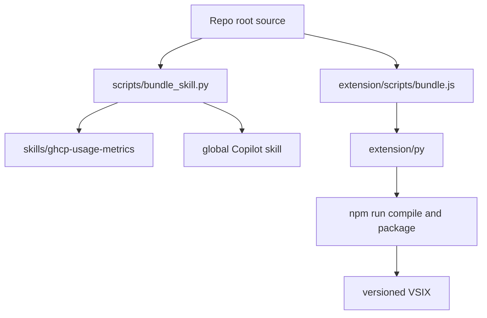

<!-- markdownlint-disable MD060 -->

A guided tour of how this project is put together and why. The [README](README.md)
covers what the tool does; this is for when you are about to change it.

[DOMAIN](DOMAIN.md) covers what the words mean and which rules must stay true.
Read that one first if you are about to change what a number means rather than
how it is computed.

Read the section you need. They stand alone, but if you are new here, first read
[The rule everything else follows](#the-rule-everything-else-follows) and
[Invariants](#invariants). Almost every design decision follows from those two.

---

## How to read this repository

Use the shortest route that matches your task:

| Goal | Start here | Continue with |
|---|---|---|
| Run or troubleshoot a scan | [Entry points](#entry-points) | [Extraction execution flow](#extraction-execution-flow) |
| Understand what a number means | [DOMAIN](DOMAIN.md) | [Data model](#data-model) |
| Add or repair a scanner | [Reading each harness](#reading-each-harness) | [Where a change belongs](#where-a-change-belongs) |
| Change dashboard behaviour | [Dashboard execution flow](#dashboard-execution-flow) | [How the page is built](#how-the-page-is-built) |
| Change the extension | [Extension execution flow](#extension-execution-flow) | [Distribution and release flow](#distribution-and-release-flow) |
| Understand a design choice | [Design decision register](#design-decision-register) | [Deliberate limits](#deliberate-limits) |
| Find a file owner | [Repository file map](#repository-file-map) | [Testing strategy](#testing-strategy) |

The repository has three documentation levels:

1. [README](README.md) explains the product and how to run it.
2. [DOMAIN](DOMAIN.md) defines the language, aggregate, and test-enforced rules.
3. This guide explains control flow, module ownership, and design rationale.

---

## Entry points

There is one data-producing entry point and several consumers around it.

| Entry point | Trigger | Responsibility | Output |
|---|---|---|---|
| `usage.py::main()` | `python usage.py` | Resolve local paths, scan all harnesses, build projects, calculate diagnostics, and write the report | `out/dashboard.html`, `out/projects.json`, `out/diagnostics.json` |
| `usage.py::main()` | `python usage.py --quick N` | Reuse cached history and defer uncached files older than `N` days | The same artifacts, marked partial in diagnostics |
| `usage.py::diagnostics()` | `python usage.py --diagnostics` | Probe whether local VS Code logs and token-bearing records exist | JSON on standard output |
| `extension/src/extension.ts::activate()` | VS Code activation | Register open, refresh, and diagnostics commands | Commands in the VS Code command palette |
| `ghcpUsage.openDashboard` | Extension command | Show the previous report immediately, then run quick and full refreshes | Live dashboard webview |
| `build_dashboard.py::build_template()` | Imported by `ghcp/report.py` | Assemble HTML, CSS, and ordered JavaScript modules | One self-contained template string |
| `skills/ghcp-usage-metrics/query.py` | Agent or terminal query | Read an existing `projects.json` without rescanning | Compact textual tables |
| `scripts/bundle_skill.py::main()` | Maintainer command | Synchronize source into standalone skill copies | Updated repository and global skill bundles |
| `extension/scripts/bundle.js` | Extension build | Copy Python and web sources into the packaged extension | `extension/py/` build output |

`usage.py` is intentionally thin. It owns platform paths and orchestration, then
delegates parsing, aggregation, and writing to `ghcp/`. Its zero-argument scanner
wrappers read module globals at call time. Tests can therefore redirect the
entire application to a synthetic filesystem while scanner implementations still
accept explicit paths and remain independently testable.

---

## Extraction execution flow

Running `python usage.py` follows this path:



Step by step:

1. `usage.py` resolves platform-specific storage locations and installed VS Code
  variants.
2. `diag_reset()` clears the shared diagnostics object in place. It is never
  rebound because scanners retain a reference to it.
3. `set_quick_window()` records an optional cutoff. Cached files remain usable
  outside that cutoff because reading a cache hit costs no log parsing.
4. Each scanner returns `project name -> client metrics`. Scanners never merge
  harnesses themselves.
5. `build_projects()` canonicalizes equivalent project names and produces one
  aggregate root with `vscode`, `cli`, and `claude` records.
6. `coverage()` identifies requests whose source retained no token payload.
7. `ghcp/report.py` injects data and diagnostics into the assembled template and
  writes all three artifacts together.

Failure is deliberately local. A malformed log line increments diagnostics and
loses that line or file, not the whole scan. A missing model name is refused
rather than silently renamed; the outer scanner boundary records the failure.

---

## Dashboard execution flow

The generated page is a static application with embedded data. It can run from
`file://` in a browser or inside a VS Code webview.



The important boundary is between scope and presentation:

1. `initData()` indexes projects, discovers the available date span, and creates
  stable project controls.
2. `computeScope()` applies date, harness, project, model, and configuration
  choices.
3. `aggregate()` reduces the selected project/client records into one view model.
4. `render()` sends that view model to focused painters for each panel.
5. Pure calculations such as session filtering, pie segmentation, forecasting,
  qualification, and date-model aggregation live in `00-lib.js` and are tested
  without a DOM.

Model filtering uses `by_dm` for additive measures and `by_sdm` for distinct
sessions. This is why every headline number, including sessions, can follow the
same selected date/model intersection without dividing a session between models.

---

## The rule everything else follows

**Only show what GitHub actually recorded.**

Not a slogan — a constraint that has shaped nearly every choice below. It means:

- No estimation. No interpolation. No back-filling a missing figure from a
  neighbouring one.
- A gap is reported as a gap, and the Diagnostics tab explains which gap and why.
- Where a number *could* mislead, the interface says so next to the number rather
  than in documentation nobody reads.

The tool once did estimate missing credits, and the totals looked better for it.
They were also wrong, and there was no way to tell which parts. Removing the
estimation dropped the headline number by about 25,000 credits and made the rest
trustworthy. That trade is the whole product.

Practical consequence: if you are adding a feature and find yourself reaching for
a plausible default to fill a hole, stop. Surface the hole.

---

## Shape of the system



**Python owns every number.** The dashboard filters, sums and formats what it is
given, but it never derives a new metric from a different source. The extension
only *runs* the Python and displays the output. The chat skill reads the same
JSON. One place to reason about correctness, three ways to look at it.

The architecture follows a functional-core, imperative-shell shape:

- `usage.py`, the scanners, the report writer, and the extension perform I/O.
- `ghcp/model.py`, naming and normalization helpers, and `web/js/00-lib.js`
  contain deterministic transformations.
- Tests inject paths and time rather than patching filesystem APIs throughout
  the implementation.

---

## Extension execution flow

The extension is an adapter, not a second implementation of the extractor.



The ready handshake matters. A webview does not receive messages sent before its
script installs the listener, so the extension keeps the newest payload in
`pendingData` until the page posts `{type: "ready"}`. Later refreshes send JSON
without replacing the HTML, preserving the selected tab, filters, and scroll
position.

The extension locates `usage.py` in this order:

1. The configured `ghcpUsage.repoPath`
2. An open workspace folder containing `usage.py`
3. The parent of the development extension folder
4. The packaged extension's `py/` directory

This ordering supports development and a self-contained `.vsix` without changing
the extractor.

---

## Data model

Everything funnels into one shape, per project, per harness.

```text
project
  name                       canonical project name
  vscode | cli | claude       one client block each
    by_day   { "2026-07-30": {sessions, requests, in, out, aiu} }
    by_model { "claude-opus-4.8": {requests, in, out, aiu} }
    by_agent { "Researcher Subagent": {...} }
    by_am    { "agent\x1fmodel": {...} }      composite, \x1f separator
    by_dm    { "date\x1fmodel": {...} }       composite, \x1f separator
    by_sdm   { "session\x1fdate\x1fmodel": 1 } session activity facts
    by_skill { "obsidian": {reads, sessions, requests, in, out, aiu} }
    by_tool  { "read_file": 3291 }             counts only
    by_lang  { "python": 42 }                  counts only
```

Two bucket types do all the work: a **day bucket** (adds `sessions`) and a **flat
bucket** (no date). `ghcp/model.py` owns both, plus `_merge`, which combines two
client blocks by summing every dimension.

### Why `by_dm` exists

Every log records the date and the model on the **same event**. Keeping only
`by_day` and `by_model` threw that pairing away, and the visible cost was a model
filter that could not move the headline numbers — a limitation that looked like
GitHub's and was actually ours.

`by_dm` keeps the pair, which is what lets a model filter re-scope everything the
way a project filter does. Read one way it gives per-day totals for the kept
models; read the other it gives per-model totals inside a date range, so the
model list follows the date controls too.

Session counts use a separate projection rather than pretending they are an
additive model measure. `by_sdm` records each observed session/date/model tuple
once. The dashboard intersects those facts with the date range and selected
models, then counts distinct session IDs. A mixed-model session therefore counts
once when either of its selected models has activity in range. With no model
filter, the dashboard keeps the complete `by_day` session total, including
recorded sessions that never reached a model.

What still cannot follow a model filter, and why:

- **Agents and skills.** No equivalent pairing is kept, so those breakdowns
  remain lifetime — `by_am` pairs agent with model, not with date.

Requests with no recorded model — pre-telemetry CLI turns and trimmed session
floors — are filed under `(no token data)` and are paired with a date like any
other. They remain in unfiltered totals and Diagnostics, but leave the scope as
soon as a model filter is active because they cannot match a selected model.

### Project identity

A project name comes from the git remote slug where one exists
(`owner/repo`), otherwise the folder or cwd leaf. `_canon` merges rows that are
the same project reached by different paths — which is why this repo's own rows
consolidated under `vinay199129/ghcp-usage-metrics` once it gained a remote.

---

## Reading each harness

Three sources, three very different formats, three different failure modes.

### VS Code — the richest and the most fragile

Three files matter, and they disagree about what they keep:

| Source                       | Holds                                    | Retention                     |
| ---------------------------- | ---------------------------------------- | ----------------------------- |
| `debug-logs/*/main.jsonl`    | Real credits + tokens per request        | Rotates; ~3 months            |
| `chatSessions/*.json\|jsonl` | Session metadata, some request bodies    | Much longer; back to January  |
| `session-store.db`           | Agent names, skill file reads            | ~70 most recent sessions      |

The scanner reads debug logs first and records which session IDs it saw, then
reads chat sessions and **skips any ID already covered**. Without that dedup the
overlap would double-count roughly 118 sessions.

Two findings worth carrying:

- **Subagents write their own logs.** A subagent launched via `runSubagent`
  writes `runSubagent-<Name>-<id>.jsonl` beside the parent's `main.jsonl`, and
  the parent emits a `child_session_ref` pointing at it. Those child logs hold
  real credits that appear nowhere in the parent — about 12,000 credits were
  invisible until they were read. Attributing them to the child is not double
  counting, and the cross-dimension invariant proves it.
- **Trimmed sessions still prove a day happened.** A chat session stripped of its
  request bodies still carries `creationDate` / `lastMessageDate`. Those light up
  the calendar day with a floor of one request and **zero tokens** — literally
  true, and the reason some projects show requests but no credits.

### Copilot CLI

Clean SQLite. `assistant_usage_events` gives per-request model, tokens and
credits. Older `turns` rows predate that table: they are counted as real requests
with `in = out = aiu = 0` and filed under the model `(no token data)`. Never
estimated — the turn text is not a usable token proxy and undercounts by roughly
100×.

### Claude Code

Line-delimited JSON. Requests, tokens and models are real; **credits are always
zero** because Claude does not report GitHub's metric. Lines with the model
`<synthetic>` are injected or aborted turns and are skipped.

That zero is silence, not thrift. Never present it as cheap.

---

## Invariants

The load-bearing ones are below. The complete register — every rule, numbered,
with the test that enforces it or an explicit `NOT ENFORCED` — lives in
[DOMAIN](DOMAIN.md#the-invariant-register). Nothing sits in between: a rule is
either guarded by a named test or listed as unguarded.

If one breaks, the change is wrong — not the test.

1. **Cross-dimension equality.** Within a client:
   `sum(by_day.aiu) == sum(by_model.aiu) == sum(by_agent.aiu) == sum(by_am.aiu) == sum(by_dm.aiu)`.
   The strongest double-counting detector in the suite; it caught the subagent
   attribution work being correct.
2. **Composite keys decompose.** Splitting `by_am` on `\x1f` and re-summing
   reproduces both `by_agent` and `by_model`; splitting `by_dm` reproduces both
   `by_day` and `by_model`.
3. **Dedup holds.** A session ID present in the debug logs is never re-read from
   chat sessions.
4. **Skill reads are exact** for sessions still on disk, and a skill's credits
   may overlap another's — a session that used three skills counts toward all
   three, so skill credits do not sum to the total.
5. **No estimation anywhere.** Grep-able: there is no back-fill path left.
6. **Session totals are never divided by model.** `by_day` and `by_skill` carry
  totals; `by_sdm` carries idempotent membership facts used for distinct counts.
7. **The published shape is a contract.** Three readers consume
   `out/projects.json`, so its key names are pinned by a test that spells every
   one of them out, and the JS test harness is checked against the same record.

---

## How the page is built

`web/` holds the real dashboard. `build_dashboard.py` is a 51-line assembler:

```text
web/dashboard.html      markers: <!--@css--> <!--@boot-js--> <!--@main-js-->
web/dashboard.css       one stylesheet, CSS custom properties for theming
web/js/boot.js          runs before paint (theme, size tier)
web/js/00-lib.js        PURE functions — no DOM, unit-tested under node
web/js/01-config.js     config, DOM refs
web/js/02-format.js  …  through 10-live.js
```

The numbered modules are concatenated **in filename order into one script** and
share a single scope. That is why `01-config.js` can declare a `const` that
`06-render.js` uses. Insert a new module by picking a number, nothing else.

### Where a change belongs

| Changing…                                          | Goes in                              | Tested by                    |
| -------------------------------------------------- | ------------------------------------ | ---------------------------- |
| How a log is read, or a new source                  | `ghcp/scan/`                         | `tests/test_scan_units.py`   |
| A bucket, a merge rule, project naming              | `ghcp/model.py`, `ghcp/naming.py`    | `tests/test_helpers.py`      |
| Formatting, config parsing, date maths, chart maths | `web/js/00-lib.js`                   | `tests/js/*.test.js`         |
| Anything touching the DOM                           | `web/js/NN-*.js`                     | `tests/js/interaction.test.js` |
| Layout or styling                                   | `web/dashboard.html`, `.css`         | Playwright pass              |

**Pure logic goes in `00-lib.js`.** Chart maths lived inside render functions
until only a browser could reach it; extracting the cores made pie slicing,
forecasting and agent ranking directly testable. When something is
time-dependent, pass `now` in as an argument — `forecastFrom(daily, now)` — so
month-end and leap-year behaviour can be asserted instead of assumed.

---

## Testing strategy

Five layers, each catching what the others cannot.

| Layer            | Tool                | Catches                                              |
| ---------------- | ------------------- | ---------------------------------------------------- |
| Unit (Python)    | pytest              | Helper logic, parsing, bucket maths                  |
| Synthetic E2E    | pytest + `tests/synthetic.py` | A whole fake log tree scanned end to end    |
| Golden master    | `tests/test_golden.py` | Any unintended change to the assembled template or extractor output |
| Unit (JS)        | `node --test`       | The pure dashboard helpers                           |
| Interaction (JS) | jsdom               | Tabs, filters, live data, config — against the real page |
| Visual / live    | Playwright          | Real data, real browser, real cascade                |

**Golden masters make refactoring safe.** `tests/golden/template.sha256` fingerprints
the assembled template and `tests/golden/projects.json` the full extractor output
for the synthetic tree. Splitting a 2,249-line file into `web/` was provable
because the hash never moved. When a change *should* alter them:

```pwsh
$env:UPDATE_GOLDEN="1"; python -m pytest tests/test_golden.py -q; Remove-Item Env:\UPDATE_GOLDEN
```

Regenerate deliberately, then verify in a browser. Never as a reflex.

**`tests/synthetic.py` is the only path-injection seam.** `point_usage_at(tmp)`
redirects every scanner at a temporary tree. Scanner implementations take
explicit paths, but `usage.py` keeps zero-argument wrappers that read module
globals *at call time* — which is what preserves that seam.

### Two traps that cost real time

- **`let` at the top level of a classic script is script-scoped, not a window
  property.** `typeof window.CFG === "undefined"` even though `CFG` exists. Tests
  cannot poke globals; drive the actual controls.
- **jsdom does not apply author attribute-selector rules.** A bare `<div hidden>`
  computes `none`, but `[hidden] { display: none !important }` does not beat a
  class rule in jsdom's cascade. So that guard is asserted against the stylesheet
  text, with the rendered result left to Playwright.

There is also a live CSS trap worth knowing, because it shipped twice: **an
author `display` rule outranks the browser's own `[hidden]` rule.** Both
`.notice { display: flex }` and `.daychip { display: inline-flex }` produced
permanently visible dead elements. One global rule near the top of the stylesheet
fixes the whole class of bug:

```css
[hidden] { display: none !important; }
```

### The TDD change loop

For behavioural work, use this order:

1. Name the domain rule and add it to [DOMAIN](DOMAIN.md) when the meaning changes.
2. Write the smallest test that fails for the intended reason.
3. Confirm the fixture resembles the real record shape. Contract tests exist
  because a plausible but false fixture once hid a broken assumption.
4. Make the smallest source change that turns the test green.
5. Run the focused test again before touching an adjacent area.
6. Run the complete Python and JavaScript suites.
7. Regenerate a golden only when the contract or assembled page changed on
  purpose, then inspect the diff.
8. Run bundle checks and browser validation.

Tests are executable domain knowledge, not snapshots to update until green. If a
test fails after an implementation change, first ask whether the implementation
violated its rule. Change the test only when the domain decision itself changed.

---

## Design decision register

These are the major decisions currently encoded in the repository. The domain
invariant register is the authority for rules; this table records why the chosen
architecture exists and what alternative was rejected.

| Decision | Chosen design | Why | Rejected alternative or cost |
|---|---|---|---|
| Data authority | Local logs are primary | They are the only source with project and named-subagent detail available to an individual user | Cloud billing APIs require organisation or enterprise privileges and still lack the required dimensions |
| Credit policy | Record GitHub AIU only | A smaller defensible total is more useful than a complete-looking guess | Token-price conversion and historical backfill were removed because readers could not distinguish fact from estimate |
| Computation owner | Python owns extraction and stored metrics | Browser, extension, and chat skill consume one contract | Reimplementing extraction in TypeScript would create two truths |
| Aggregate root | Project | Project is the unit readers filter, rank, and investigate | A flat global event list would simplify ingestion but complicate every consumer and expose raw-log instability |
| Harness boundary | Separate `vscode`, `cli`, and `claude` records | Sources have different retention and evidence quality | Flattening first would erase provenance and make diagnostics weaker |
| Projections | Keep parallel additive dimensions | Filters and reports stay cheap in a static page | Shipping raw events would increase report size and move domain reconstruction into JavaScript |
| Composite dimensions | Preserve pairings only when a feature needs them | `by_dm`, `by_am`, and `by_sdm` retain relationships separate aggregates lose | A generic multidimensional cube would add complexity and sparse data without a current query |
| Session modelling | Store set-like activity facts in `by_sdm` | Sessions span models and must be distinct-counted after filtering | Dividing or summing sessions by model produces false totals |
| No-model activity | Keep it as real activity but not a selectable model | The source proves a request or active day but names no model | Dropping it hides evidence; presenting it as a model invents a choice the user never made |
| VS Code precedence | Debug logs win over saved chat sessions | They carry richer request-level token and credit data | Reading both doubles overlapping sessions |
| Trimmed-session floor | Count one interaction on proven activity dates, with zero tokens and credits | Creation and last-message timestamps prove activity, not volume | Ignoring them creates false empty days; estimating volume invents data |
| Subagent attribution | Read child logs separately | `runSubagent` child logs contain real usage absent from the parent | Folding them into the parent loses named cost; adding them to parent totals double-counts |
| Missing model handling | Raise and diagnose | A source format change must become visible | The deleted `"?"` fallback silently created a fake domain member |
| Quick scan | Reuse all cache hits and defer only uncached old files | Fast startup without throwing away already parsed history | A strict date cutoff would make warm scans less complete for no benefit |
| Failure containment | Continue after bad files and report them | Local log corpora are large and partially corruptible | Failing the entire dashboard for one malformed line makes diagnostics inaccessible |
| Report format | One self-contained HTML page plus JSON artifacts | Works from disk, in a webview, and as a portable report | A server would enable live APIs but add installation, security, and lifecycle costs |
| Dashboard modules | Ordered classic scripts sharing one scope | Preserves a dependency-free static artifact while allowing source decomposition | A bundler or framework would add a runtime toolchain to an output that needs none |
| Pure UI logic | Put it in `00-lib.js` with explicit inputs | Node tests can verify date, chart, filter, and ranking decisions deterministically | Logic trapped in DOM renderers requires slow browser tests and encourages untested copies |
| Extension refresh | Post data into stable HTML | Preserves reader state during a full rescan | Replacing `webview.html` resets scripts, scroll, and controls |
| Distribution | Root source plus generated or synchronized copies | The skill and `.vsix` work standalone | Editing copies directly creates silent behavioural drift |
| Internal vocabulary | Keep `client`; display “Harness” | The rename would create broad churn without changing behaviour | A repository-wide rename would obscure meaningful diffs for cosmetic consistency |

When a new decision changes what a metric means, add or update a domain invariant
first. When it only changes module arrangement, record it here.

---

## Distribution and release flow

Source moves through two independent packaging paths:



The repository skill copy is committed because it is a distributable artifact.
The global skill and `extension/py/` are machine-local build outputs. Extension
versioning is guarded by `extension/scripts/check-version.js`: the version in
`package.json` must match the newest changelog heading. Packaging also removes
stale `.vsix` files before creating a new one.

After changing extractor or dashboard source:

```pwsh
python -m pytest -q
python scripts/bundle_skill.py
python scripts/bundle_skill.py --check
node extension/scripts/bundle.js
cd extension
npm run compile
```

Do not edit synchronized copies. A change belongs in the root source even when
the defect was first observed in the installed skill or extension.

---

## Repository file map

This catalog covers maintained source, tests, packaging, and operator files.
Generated folders such as `out/`, `extension/out/`, `extension/py/`, caches,
`node_modules/`, and `.vsix` packages are products rather than source.

### Root files

| Path | Purpose |
|---|---|
| `usage.py` | Application entry point, platform path discovery, CLI options, scan orchestration, and test-facing wrappers |
| `build_dashboard.py` | Reads `web/` and assembles the self-contained dashboard template |
| `README.md` | Product overview, commands, features, limitations, and top-level layout |
| `DOMAIN.md` | Ubiquitous language, aggregate definition, invariant register, and known modelling tensions |
| `ARCHITECTURE.md` | Canonical technical deep dive, including flow, ownership, decisions, and maintenance guidance |
| `package.json` | Root JavaScript test command and jsdom development dependency |
| `package-lock.json` | Reproducible Node development dependency graph |
| `pytest.ini` | pytest discovery configuration |

### Python package

| Path | Purpose |
|---|---|
| `ghcp/__init__.py` | Marks the extractor package |
| `ghcp/constants.py` | Shared domain spellings such as agents, the composite-key separator, and no-token placeholder |
| `ghcp/naming.py` | URI/path conversion, repository slug discovery, junk-directory rejection, and canonical project identity |
| `ghcp/normalize.py` | Date, model, and agent normalization at source boundaries |
| `ghcp/jsonl.py` | Replay of patched VS Code chat-session JSONL and code-fence language extraction |
| `ghcp/model.py` | Metric buckets, accumulation, merge, session totals, and `Project` aggregate construction |
| `ghcp/window.py` | Mutable quick-scan cutoff and file-window decisions |
| `ghcp/diagnostics.py` | Shared scan counters, failure capture, no-token coverage, and reason classification |
| `ghcp/billing.py` | VS Code request-log parsing, cache validation, cache persistence, and projection attribution |
| `ghcp/report.py` | Template data injection and writing of HTML, project JSON, and diagnostics JSON |
| `ghcp/scan/__init__.py` | Marks the harness-scanner package |
| `ghcp/scan/vscode.py` | VS Code workspace, debug-log, chat-session, subagent, metadata, and skill-read extraction |
| `ghcp/scan/cli.py` | Copilot CLI SQLite extraction, including pre-telemetry requests without token estimates |
| `ghcp/scan/claude.py` | Claude Code JSONL extraction with real tokens and zero GitHub AIU |

### Dashboard source

| Path | Purpose |
|---|---|
| `web/dashboard.html` | Semantic page structure and insertion markers for CSS, boot code, and main scripts |
| `web/dashboard.css` | Layout, design tokens, themes, responsive behaviour, chart presentation, and accessibility states |
| `web/js/boot.js` | Pre-paint theme and viewport-size setup |
| `web/js/00-lib.js` | Pure exported domain and presentation helpers used by browser code and Node tests |
| `web/js/01-config.js` | Configuration state, constants, persisted preferences, and DOM references |
| `web/js/02-format.js` | Display formatting and cost helpers that depend on active configuration |
| `web/js/03-calendar.js` | Daily chart, activity calendar, date-range interaction, and project-table rendering |
| `web/js/04-panels.js` | Project detail, model, agent, skill, strength, and forecast panel rendering |
| `web/js/05-insights.js` | Higher-level insight and breakdown rendering orchestration |
| `web/js/06-render.js` | Scope computation, aggregation, and the main render pipeline |
| `web/js/07-layout.js` | Tab, theme, accent, and responsive layout behaviour |
| `web/js/08-diagnostics.js` | Scan diagnostics and provenance presentation |
| `web/js/09-controls.js` | Filter, config, refresh, export, and transient-status event handlers |
| `web/js/10-live.js` | Extension messaging, in-place dataset replacement, and auto-refresh integration |

### Extension

| Path | Purpose |
|---|---|
| `extension/src/extension.ts` | VS Code activation, commands, Python execution, webview lifecycle, CSP, and live-data handshake |
| `extension/package.json` | Extension manifest, commands, settings, version, and build scripts |
| `extension/tsconfig.json` | TypeScript compiler settings |
| `extension/README.md` | Extension-specific setup, commands, settings, and packaging instructions |
| `extension/CHANGELOG.md` | Shipped release history and pre-1.0 development narrative |
| `extension/LICENSE` | License included in the packaged extension |
| `extension/media/icon.png` | Marketplace and extension-list icon |
| `extension/scripts/bundle.js` | Copies root Python, package, and web source into `extension/py/` |
| `extension/scripts/check-version.js` | Rejects package/changelog version drift |
| `extension/scripts/clean-vsix.js` | Removes stale packages before building a new `.vsix` |
| `extension/scripts/make_icon.py` | Reproducibly generates the extension icon using the Python standard library |

### Skill and synchronization

| Path | Purpose |
|---|---|
| `skills/ghcp-usage-metrics/SKILL.md` | Agent instructions, triggers, query workflow, and honesty constraints |
| `skills/ghcp-usage-metrics/query.py` | Compact command-line queries over `projects.json` |
| `skills/ghcp-usage-metrics/usage.py` | Synchronized standalone extractor entry point; never edit directly |
| `skills/ghcp-usage-metrics/build_dashboard.py` | Synchronized standalone dashboard assembler; never edit directly |
| `skills/ghcp-usage-metrics/ghcp/` | Synchronized standalone Python package; never edit directly |
| `skills/ghcp-usage-metrics/web/` | Synchronized standalone dashboard source; never edit directly |
| `scripts/bundle_skill.py` | Discovers source, detects drift, updates skill copies, and prunes generated files |
| `.github/instructions/skill-sync.instructions.md` | Repository editing, TDD, invariant, and synchronization rules |

### Tests

| Path | Purpose |
|---|---|
| `tests/conftest.py` | Test import setup |
| `tests/synthetic.py` | Faithful fake harness filesystems and the path-injection seam |
| `tests/test_helpers.py` | Python unit tests for naming, normalization, JSONL, buckets, merge, and project helpers |
| `tests/test_scan_units.py` | Focused tests for windows, billing, caches, scanners, skills, reports, and coverage |
| `tests/test_extract_synthetic.py` | End-to-end extraction and cross-dimension reconciliation over synthetic logs |
| `tests/test_invariants.py` | Domain rules expressed as direct executable assertions |
| `tests/test_contract.py` | Published Python data shape and composite-key contract |
| `tests/test_quick_and_diagnostics.py` | Quick-scan, cache, bad-line, coverage, and diagnostics behaviour |
| `tests/test_write_dashboard.py` | Report rendering and placeholder replacement smoke tests |
| `tests/test_golden.py` | Deliberate-change guard for assembled HTML and synthetic project output |
| `tests/test_bundle_sync.py` | Repository/global skill drift and source-discovery enforcement |
| `tests/test_snapshot_live.py` | Structural and reconciliation checks against an available real snapshot |
| `tests/test_js_suite.py` | Runs the Node suite from pytest when Node dependencies are present |
| `tests/golden/contract.json` | Machine-readable extractor contract shared with JavaScript tests |
| `tests/golden/projects.json` | Golden synthetic extraction output |
| `tests/golden/template.sha256` | Golden assembled-dashboard fingerprint and length |
| `tests/js/harness.js` | Boots the assembled dashboard in jsdom with contract-shaped fixtures |
| `tests/js/lib.test.js` | Formatting, config, date, session, and foundational helper tests |
| `tests/js/dimensions.test.js` | Date-model aggregation and filtered-session semantics |
| `tests/js/insights.test.js` | Pie, forecast, agent ranking, and minimum-sample decisions |
| `tests/js/interaction.test.js` | Tabs, filters, live updates, config, diagnostics, status, and injection safety |
| `tests/js/qualify.test.js` | Lifetime project qualification and hidden-empty-project behaviour |
| `tests/js/contract.test.js` | Dashboard fixture and composite-key compatibility with the extractor contract |

### Automation and editor support

| Path | Purpose |
|---|---|
| `.github/workflows/tests.yml` | CI installation, Python tests, Node tests, and bundle-sync validation |
| `.vscode/tasks.json` | Generate, open, test, sync, compile, package, install, and launch workflows |
| `.vscode/launch.json` | Python debugging and Extension Development Host launch profiles |
| `.vscode/settings.json` | Workspace pytest discovery and editor defaults |

---

## Tracing a defect to its owner

Use the visible symptom to narrow the path before editing:

| Symptom | First evidence | Owning area |
|---|---|---|
| A source is missing entirely | `python usage.py --diagnostics` and `out/diagnostics.json` | Platform paths in `usage.py`, then the matching scanner |
| A request has wrong tokens or credits | One raw event and its parsed billing record | `ghcp/billing.py` or the source scanner |
| One project appears twice | Raw repository or cwd values and canonical basenames | `ghcp/naming.py`, then `ghcp/model.py::build_projects` |
| Totals disagree by dimension | Cross-dimension invariant output | The attribution site that omitted or duplicated a projection |
| A filter changes the wrong panels | Contract-shaped fixture and scoped aggregate | `web/js/00-lib.js`, then `web/js/06-render.js` |
| A control appears inert | State change at the control plus target panel | `09-controls.js`, `01-config.js`, and the owning renderer |
| Browser works but webview does not | Extension output channel and webview messages | `extension/src/extension.ts`, CSP, or `10-live.js` |
| Skill and root reports differ | Bundle check and each copy's generated timestamp | `scripts/bundle_skill.py`; synchronize rather than patching the copy |
| Packaged extension looks stale | Installed extension registry, folder, and package version | Extension clean/install tasks and bundle output |

The cheapest discriminating check should run immediately after the first edit.
For scanner work, use a focused pytest. For pure dashboard logic, use one Node
test file. For DOM behaviour, use the jsdom interaction suite. Use Playwright for
CSS cascade, layout, and final live-data validation rather than as the first line
of debugging.

---

## Four copies, one source

The tool exists in four places on a developer machine. Only the first is edited.

| Copy                                | Purpose                        | Tracked |
| ----------------------------------- | ------------------------------ | ------- |
| Repo root                           | **The source. Edit here.**     | yes     |
| `skills/ghcp-usage-metrics/`        | Standalone, shareable bundle   | yes     |
| `~/.copilot/skills/ghcp-usage-metrics/` | What chat actually loads   | no      |
| `extension/py/`                     | Packaged into the `.vsix`      | no      |

```pwsh
python scripts/bundle_skill.py          # refresh copies 2 and 3
python scripts/bundle_skill.py --check  # fail if they drifted
node extension/scripts/bundle.js        # refresh copy 4
```

`tests/test_bundle_sync.py` fails the build when the committed bundle falls
behind, so this cannot rot quietly. The rule is in
`.github/instructions/skill-sync.instructions.md`, which applies automatically
when the relevant files are edited.

---

## Things that look like bugs and are not

Worth checking here before investigating.

| Observation                                     | Explanation                                                                 |
| ----------------------------------------------- | --------------------------------------------------------------------------- |
| Some projects show requests but zero credits    | Pre-telemetry CLI turns and trimmed chat sessions. Real calls, no recorded size. Listed per project in Diagnostics. |
| The dashboard shows fewer projects than the JSON | Projects with no recorded tokens are hidden by default, behind a link in the sidebar. |
| Early months look quiet                          | `copilotUsageNanoAiu` was adopted mid-May 2026. Before that, real requests and tokens, zero credits. |
| Claude Code costs nothing                        | It reports no credits at all.                                                |
| Agent names collapse into "GitHub Copilot Chat"  | Agent-picker personas are not recorded anywhere retrievable. Only `runSubagent` subagents self-identify. |
| A model filter does not change the totals        | Fixed — it does now. If you see this, the report predates `by_dm`.          |
| A model filter hides unattributed requests        | Deliberate — no selected model can match activity whose model was not recorded. |
| Skill credits do not sum to the total            | Deliberate overlap — a multi-skill session counts toward each.               |

---

## Deliberate limits

Not oversights. Revisit only with new extraction, not new UI.

- **No cloud reconciliation.** GitHub's authoritative totals need organisation-owner
  or enterprise-admin access. An individual account — including an
  enterprise-managed one — gets 403 or 404. Local logs are the only source, and
  the totals here are a floor.
- **No date × agent or date × skill breakdown.** `by_dm` did this for models;
  the same treatment would work for agents and skills if it is ever worth the
  extra size.
- **Agent-picker personas are unrecoverable.** They are not written down.
- **Retention is not ours to fix.** Rotated logs are gone.
