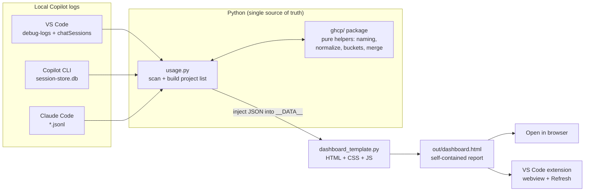

# GHCP Usage Metrics

A local, honest dashboard for your own GitHub Copilot usage. It reads the logs
Copilot already writes on your machine, then renders one self-contained HTML page
showing AI Units (AIU), requests, tokens, projects, models, agents, and skills.

Nothing leaves your machine, and nothing is estimated — only values GitHub
actually recorded are shown.

## What it looks at

Copilot leaves a trail in a few local places. The extractor reads three
"harnesses":

- **VS Code** — chat debug logs and saved chat sessions under `%APPDATA%/Code`.
- **Copilot CLI** — the SQLite store under `~/.copilot`.
- **Claude Code** — session JSONL under `~/.claude/projects` (requests and tokens only; it reports no AIU).

## How it works

The design decision that shapes everything: **Python is the single source of
truth**. `usage.py` does all the scanning and math; the HTML template is just a
view; the VS Code extension only *runs* the Python and shows the result. That
keeps one place to reason about the numbers.



Walking the pieces:

1. **Scan.** `usage.py` walks each harness, attributes every session to a
   project (git repo slug, else the folder/cwd name), and rolls activity up into
   per-day and per-dimension buckets (model, agent, skill).
2. **Normalize + merge.** The `ghcp/` package holds the pure, testable helpers —
   project naming, model/agent normalization, the bucket types, and the `_merge`
   that combines harnesses without double-counting.
3. **Render.** `usage.py` serializes the project list to JSON and drops it into
   the single `__DATA__` placeholder in `dashboard_template.py`, then writes
   `out/dashboard.html`. All markup, styling, and interactivity live in that
   template.
4. **View.** Open the HTML directly, or run the extension so a **Refresh data**
   button can re-run the extractor live inside a webview.

Why "nothing is estimated": AIU comes straight from GitHub's own
`copilotUsageNanoAiu` telemetry. Sessions logged before that telemetry existed
still count their real requests and tokens, but simply add zero AIU rather than a
guess.

## Run it

```pwsh
python usage.py            # writes out/dashboard.html
```

Then open `out/dashboard.html`, or use the VS Code task **Launch dashboard** to
generate and open it in one step.

Run the tests with:

```pwsh
python -m pytest -q
```

## Project layout

| Path                     | Job                                                       |
| ------------------------ | -------------------------------------------------------- |
| `usage.py`               | Scans the logs, builds the project list, writes the HTML. |
| `dashboard_template.py`  | The dashboard UI (HTML/CSS/JS) with one `__DATA__` slot.  |
| `ghcp/`                  | Pure, unit-tested helpers (naming, normalize, buckets, merge). |
| `tests/`                 | pytest suite over the helpers and a synthetic end-to-end run. |
| `extension/`             | VS Code extension that runs the extractor in a webview.   |

The extension keeps its own [README](extension/README.md) with setup and
packaging details.
