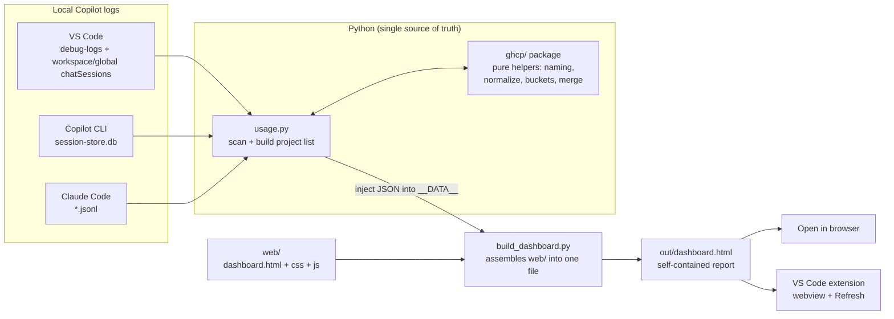

# GHCP Usage Metrics

A local, honest dashboard for your own GitHub Copilot usage. It reads the logs
Copilot already writes on your machine, then renders one self-contained HTML page
showing AI Units (AIU), requests, tokens, projects, models, agents, and skills.

Nothing leaves your machine, and nothing is estimated — only values GitHub
actually recorded are shown.

To install the VS Code extension or the chat skill, see
[INSTALL.md](INSTALL.md).

## What it looks at

Copilot leaves a trail in a few local places. The extractor reads three
"harnesses":

- **VS Code** — chat debug logs and saved chat sessions in the VS Code user
  directory (`%APPDATA%/Code` on Windows, `~/Library/Application Support/Code` on
  macOS, `~/.config/Code` on Linux), including Insiders and VSCodium.
- **Copilot CLI** — the SQLite store under `~/.copilot`.
- **Claude Code** — session JSONL under `~/.claude/projects` (requests and tokens only; it reports no AIU).

## How it works

The design decision that shapes everything: **Python is the single source of
truth**. `usage.py` does all the scanning and math; the HTML template is just a
view; the VS Code extension only *runs* the Python and shows the result. That
keeps one place to reason about the numbers.

### Choose the VS Code data source

In the extension dashboard, open **Config** (the gear in the toolbar) and use
**VS Code data source**:

- **Automatic (recommended)** compares agent debug logs with saved chat
   sessions for each session and keeps the fuller copy.
- **Agent debug logs only** uses the richest per-call source, including model,
   token, tool and subagent detail, but omits sessions after those logs rotate.
- **Saved chat sessions only** works without debug logs, but VS Code trims older
   turns and older sessions may not carry AI-credit fields.

If no agent debug logs exist, the dashboard shows **Enable logging**. It sets
`github.copilot.chat.agentDebugLog.fileLogging.enabled` to `true`; reload VS
Code and start a new chat before refreshing the dashboard. The setting improves
new activity only and cannot recreate logs that were never written.

In a generated browser report the selector is read-only because a static HTML
file cannot run Python. Rebuild it explicitly instead:

```powershell
python usage.py --source auto       # or debug / sessions
```



Walking the pieces:

1. **Scan.** `usage.py` walks each harness, attributes every session to a
   project (git repo slug, else the folder/cwd name), and rolls activity up into
   per-day and per-dimension buckets (model, agent, skill).
2. **Normalize + merge.** The `ghcp/` package holds the pure, testable helpers —
   project naming, model/agent normalization, the bucket types, and the `_merge`
   that combines harnesses without double-counting.
3. **Render.** `build_dashboard.py` stitches `web/dashboard.html`, the stylesheet
   and the JavaScript modules into one string; `usage.py` drops the project JSON
   into its `__DATA__` placeholder and writes `out/dashboard.html`. The result
   has no external references, so it opens anywhere.
4. **View.** Open the HTML directly, or run the extension so a **Refresh data**
   button can re-run the extractor live inside a webview.

Why "nothing is estimated": AIU comes straight from GitHub's own
`copilotUsageNanoAiu` telemetry. Sessions logged before that telemetry existed
still count their real requests and tokens, but simply add zero AIU rather than a
guess.

## Run it

```pwsh
python usage.py            # writes out/dashboard.html
python usage.py --quick 10 # only the last 10 days of uncached logs
```

Then open `out/dashboard.html`, or use the VS Code task **Launch dashboard** to
generate and open it in one step.

Run the tests with:

```pwsh
python -m pytest -q                    # Python, and the JS suite through it
node --test "tests/js/*.test.js"       # JavaScript on its own
```

## What you get

Eight views over the same filtered scope:

| View           | Shows                                                                    |
| -------------- | ------------------------------------------------------------------------ |
| **Overview**   | Credits per day, top projects, and a per-project table that expands into models, agents and tools. |
| **Calendar**   | A day grid you can hover for detail, click to filter to one day, or drag across for a range. Sessions-only reports use one coverage note instead of repeating the same warning on most days. |
| **Breakdown**  | Requests by harness, credits by model, top projects, and code output by language. |
| **Agents**     | Base harnesses and `runSubagent` subagents ranked by spend, with cost-per-request signals. |
| **Skills**     | Which `SKILL.md` files actually got read, and what the sessions that used them cost. |
| **Strengths**  | Your most-used model and agent, output volume, edit and read tool-calls, turns per session. |
| **Forecast**   | Projected spend from your recent rate, against a monthly budget if you set one. |
| **Diagnostics**| What the last scan read, skipped and failed on — including which requests carry no token payload. |

Filters apply everywhere at once: date range, harness, and project. Set a cost
per credit in **Config** and every figure gains a currency column. Projects that
never recorded a token start hidden behind a link, and the Diagnostics tab can be
switched off once you no longer need it.

## Going deeper

[ARCHITECTURE.md](ARCHITECTURE.md) is the guided tour: the data model, how each
harness is read, the invariants that keep the numbers honest, how the page is
assembled, and where to make a given change. Read it before touching the
extractor or the dashboard internals.

## Ask it questions in chat

The repo ships an agent skill in `skills/ghcp-usage-metrics/`. With it loaded, you
can ask an AI coding agent things like "which project costs the most", "what is my
priciest subagent", or "refresh my usage data", and it answers from your own
numbers.

The skill exists because `out/projects.json` is around 130 KB of nested JSON, far
too much to read into a conversation. Instead it calls a small query CLI that
prints one compact table per question:

```pwsh
python skills/ghcp-usage-metrics/query.py summary
python skills/ghcp-usage-metrics/query.py projects --top 10
python skills/ghcp-usage-metrics/query.py agents
python skills/ghcp-usage-metrics/query.py project ghcp-usage-metrics
```

| Command             | Answers                                                  |
| ------------------- | -------------------------------------------------------- |
| `summary`           | Totals plus the split across the three harnesses.         |
| `projects [--top N]`| Projects ranked by AIU.                                   |
| `agents`            | Agents and subagents ranked by AIU, with AIU per request. |
| `models`            | Models ranked by AIU.                                     |
| `skills`            | Skills ranked by invocation count.                        |
| `daily`             | One row per active day.                                   |
| `project <name>`    | One project in detail, matched on a substring.            |

Add `--since YYYY-MM-DD` and `--until YYYY-MM-DD` to narrow the day-based
commands, or `--data <path>` to point at a report elsewhere.

### Sharing it

The skill folder is self-contained. Alongside the instructions and the query CLI
it carries a copy of the extractor, so `skills/ghcp-usage-metrics/` works on its
own: zip it, drop it in someone's skill directory such as `~/.copilot/skills/`,
or copy it anywhere and run `python usage.py` inside it. Python 3 with no
third-party packages is the only requirement.

What never travels is your data. Everyone runs the extractor against their own
machine and gets their own `out/projects.json`, which stays local and is
git-ignored. Only code and instructions are shared.

The bundled copies are committed so a plain clone or download already works, but
that means they can drift. After changing `usage.py`, `build_dashboard.py`, or
anything in `ghcp/` or `web/`, refresh them:

```pwsh
python scripts/bundle_skill.py
```

It reports what it updated, or says the bundle is already current. A test fails
the build if the committed copy falls behind, so the drift cannot go unnoticed.

### What the skill cannot tell you

The tool refuses to guess, so several questions have no answer rather than an
approximate one. Worth knowing before you trust a number:

| Limitation                      | What it means in practice                                                                                          |
| ------------------------------- | ------------------------------------------------------------------------------------------------------------------ |
| Credits start at a floor        | Each harness began reporting AI credits at a different time — VS Code months before the Copilot CLI. The dashboard computes that floor and opens there, so a total never averages complete months against incomplete ones. Earlier data is kept and still selectable; Config shows the computed date and Diagnostics explains it. |
| AIU predates its own telemetry  | Sessions logged before `copilotUsageNanoAiu` existed count real requests and tokens but add zero AIU. Early months read low because the metric is missing, not because usage was. |
| Claude Code reports no AIU      | Its requests and tokens are real; its AIU is genuinely zero. That is silence, not thrift.                          |
| "Cached" is not one definition  | VS Code publishes a single `cachedTokens` (cache reads); the CLI publishes reads and writes separately and both are counted. So VS Code's cache share reads ~94% and the CLI's ~99% for the same behaviour. GitHub's own reports count writes too. |
| Cache reporting started later   | Roughly 8% of VS Code requests predate it. Those raise the request count without raising the cache count, so "not reported" stays distinct from "nothing cached" rather than being recorded as zero. |
| The newest days under-report    | The CLI writes its billing rows when a session closes, so the most recent day or two can show requests with no credits yet. A floor fixes the start of the series, not the end. |
| Agent personas fold together    | Only subagents launched through the `runSubagent` tool get their own attribution. Agent-picker modes are recorded as "GitHub Copilot Chat". |
| Session retention is short      | VS Code keeps roughly the 70 most recent sessions in its store, so older agent and skill runs are purged and unrecoverable. Session names exist for about two thirds of sessions; the rest show their id. |
| Some breakdowns ignore dates    | Per-day buckets carry no agent or skill dimension, so those breakdowns are lifetime totals. Models are dated and do follow `--since` / `--until`. |
| Skill totals overlap            | A session that invoked three skills counts its tokens toward all three, so skill AIU does not sum to the overall total. |
| Logs rotate                     | VS Code debug logs are trimmed and saved workspace/no-workspace sessions keep only some requests, so older days are sparse. Recorded summary calls add their real tokens and cache usage, but zero credits when the saved object records none. |
| No cloud reconciliation         | Enterprise-managed accounts cannot reach GitHub's org metrics or personal billing APIs. Local logs are the only source. |

## Project layout

| Path                     | Job                                                       |
| ------------------------ | -------------------------------------------------------- |
| `usage.py`               | Entry point: platform paths, CLI flags, scan orchestration. |
| `build_dashboard.py`     | Assembles `web/` into the single template string.         |
| `ghcp/`                  | The extractor: scanners, billing, buckets, merge, diagnostics, report. |
| `web/`                   | The dashboard itself — markup, stylesheet, and JS modules. |
| `skills/`                | Agent skill: instructions, query CLI, and a bundled copy of the extractor. |
| `scripts/`               | Refreshes the copy of the extractor inside `skills/`.     |
| `tests/`                 | pytest over the extractor, `node --test` over the dashboard. |
| `extension/`             | VS Code extension that runs the extractor in a webview.   |

The extension keeps its own [README](extension/README.md) with setup and
packaging details.
